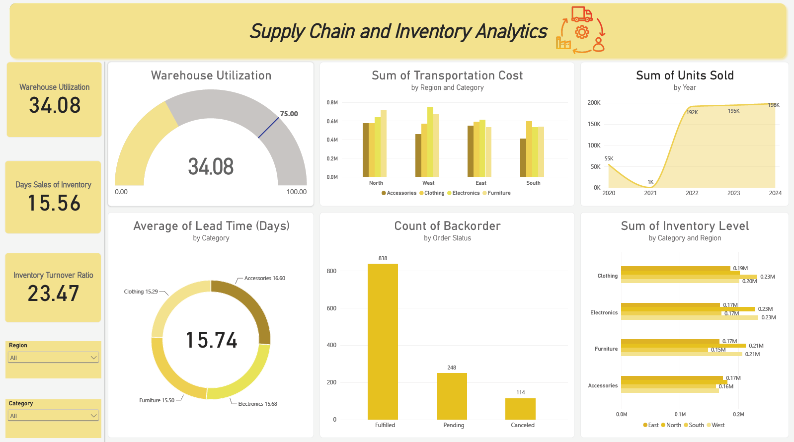

## Supply Chain Inventory Analytics Power BI Dashboard

Built an end-to-end Supply Chain & Inventory Analytics Dashboard in Power BI to monitor operational KPIs, inventory velocity, and 
logistics cost distributions across regional networks.

### 🚀 Project Highlights

- **Data Cleaning & Transformation**: Ingested and transformed multi-category inventory datasets using **Power Query**, enforcing consistent schema structures to analyze **640k+ total units sold** across multi-year cycles (2020–2024).
- **KPI Dashboards & Benchmarking**: Designed a real-time monitoring Dashboard for core supply chain metrics:
  - **Inventory Turnover Ratio**: (ITR) It came out to 23.47 and a **Days Sales of Inventory (DSI)** of 15.56 days.
  - **Warehouse Utilization**: Built target-performance benchmarks identifying current capacity utilization (**34.08%**) against the **75.00% operational target**.
  - **Category Lead Times**: Visualized average fulfillment cycles (**15.74 days overall**), spanning *Accessories* (16.60d), *Electronics* (15.68d), *Furniture* (15.50d), and *Clothing* (15.29d).
- **Custom DAX & Advanced Analytics**: Developed DAX measures to calculate dynamic aggregations, segment regional transportation costs across 4 product categories, and evaluate pipeline bottlenecks across **1,200 total orders** (**838 Fulfilled**, **248 Pending**, and **114 Canceled**).
- **Interactive Multi-Dimensional Filtering**: Integrated regional (*North, South, East, West*) and product-level slicers to enable granular drill-downs into inventory volume distributions and logistics cost drivers.

#### 📊 Visualization & BI: Power BI, DAX, Data Modeling
#### 🌎 Domain: Supply Chain Analytics, Inventory Optimization, Logistics Performance Measurement
